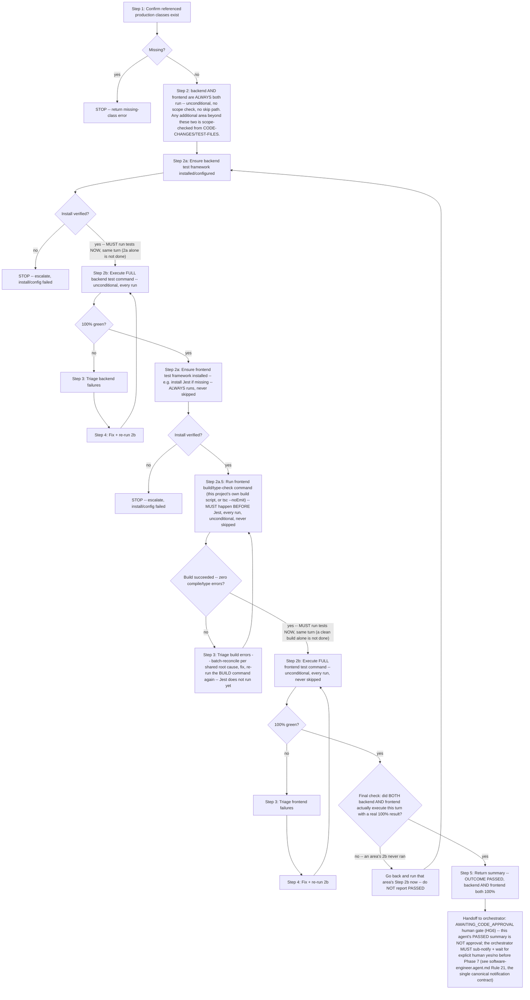

# Sub-Agent: Run Tests

Single responsibility: run the test suite written by `sub-write-tests` against the production code produced by `sub-write-code`, fix any failures, and confirm a green build.

## Inputs Expected

The calling agent must provide:
1. `CODE-CHANGES` — structured output from `sub-write-code` (list of files created/modified)
2. `TEST-FILES` — structured output from `sub-write-tests` (list of test files and what they cover)

**🛑 `token-efficient-workflow` MUST be applied for the entire run — CRITICAL, NON-NEGOTIABLE, not conditional on whether triage ends up calling `graphify` (this agent invokes `graphify` via `execute` during triage, so it is in scope for this rule on every invocation).** If the orchestrator's prompt did not include its rules verbatim, `read/readFile` `.github/skills/token-efficient-workflow-skill/SKILL.md` yourself before doing anything else and apply it — do not proceed without it, and do not treat its absence from the prompt as license to skip it.

## Workflow

### Execution Loop

**Both of this project's areas — `backend/` and `frontend/` — run on every single invocation of this agent, unconditionally, with no scope check and no skip path.** There is no "is frontend in scope" decision to get wrong anymore: frontend's test run has gone missing often enough in practice (list omissions, misjudged scope) that scope-based conditionality is retired for these two areas entirely. Backend runs first, frontend second, each with its own install-check (2a) → **execute the full test command (2b, mandatory, same turn as 2a)** → triage → fix-and-re-run loop until it's 100% green, before the next area starts. Finishing 2a is not finishing the area — 2b's actual test run is what the loop is for. A project with additional areas beyond these two repeats the same per-area loop for each one, and only those additional areas ever use scope-based skipping (see Step 2).



**Installing/verifying a test framework (2a) is never the finish line — Step 2b's actual test-command execution MUST follow immediately, in the same turn, before anything else, including before writing any summary.** There is no edge in this diagram from a setup/verify node straight to `DONE` — every path to `DONE` passes through an actual `Run ... test command` node with a real green result, and through the `VALIDATE` cross-check. Backend never starts its loop after frontend, and frontend's loop never starts while backend is still red — see Step 2's dependency-order rule and Step 4's hard rule below for why.

**`frontend` alone also has a build/type-check gate (`FEBUILD`/`FEBUILDCHECK`) between its install-verify and its actual Jest run — see Step 2a.5 below (a real incident this closes: `frontend` sat at 0/110 executing across three separate sessions because TypeScript compilation errors were being discovered one cryptic Jest failure at a time — `import.meta` syntax errors, missing exports, type mismatches — instead of through a single, fast, authoritative build/type-check that names every error at once).** Jest never runs against a `frontend` area whose build is not currently clean — `FEBUILDCHECK` must show zero compile/type errors before `FERUN` (Step 2b) is ever invoked.

**There is no `BECHK`/`FECHK` scope-check node anymore, and that is deliberate.** Frontend test runs have gone missing often enough in practice — via list omission, misjudged scope, or a skipped-then-forgotten area — that the fix is to remove the decision point altogether: `backend/` and `frontend/` both run in full, every single time this agent is invoked, with no "is this in scope" branch to get wrong. `VALIDATE`, right before `DONE`, is a last check that BOTH areas actually had their Step 2b run this turn with a real result — if either one was somehow bypassed, `VALIDATE` sends the flow back to run it rather than letting a `PASSED` summary go out with a silently-skipped area.

### Step 1: Confirm Tests Now Compile

Before running, verify that the production classes referenced in the test files now exist (they are listed in `CODE-CHANGES`). If any referenced class is missing, stop and return an error listing the missing items — do not attempt to run.

### Step 2: Run the Full Test Suite

This project is split into two areas/roots: **`backend/`** (PHPUnit) and **`frontend/`** (Jest). **Both run on every single invocation of this agent — unconditionally, regardless of what `CODE-CHANGES`/`TEST-FILES` say, with no "in scope" determination and no skip path for either one.** This is a deliberate change from a scope-based check: relying on `CODE-CHANGES`/`TEST-FILES` to decide whether frontend needed to run is exactly how frontend test runs kept going missing in practice (the lists under-reported, or the agent misjudged scope, and frontend was skipped). There is no such judgment call to make anymore — run backend's full suite, then frontend's full suite, every time, full stop.

If this project ever gains a third area beyond these two fixed ones, *that* additional area still uses scope-based detection: a file belonging to it in `CODE-CHANGES`/`TEST-FILES` puts it in scope, and only such a genuinely untouched additional area may be marked `SKIPPED` in the Step 5 summary — `backend` and `frontend` themselves may never be marked `SKIPPED`, ever.

Run areas in dependency order — **the area other areas depend on (e.g. an API a UI consumes) first, never the reverse or interleaved** — so a failure in the depended-upon area is triaged and fixed before dependent-area results are even considered. `frontend` depends on `backend`'s API, so `backend` runs first, `frontend` second. For each area, do Step 2a then Step 2b, in that order, before moving to the next area.

#### Step 2a: Ensure This Area's Test Framework Is Installed (runs FIRST, per area)

**A missing test framework/tooling install is never a reason to skip, defer, or mark an in-scope area's suite "not run" — install it and proceed.** Before the first test run of this ticket for a given area, check whether that area's coding-standards skill documents how to verify and, if missing, install/configure its test framework (e.g. a JS/TS frontend's skill may cover installing Jest) — follow it exactly. If the skill doesn't cover this and the framework is genuinely absent, install the ecosystem-standard default for that language and wire it into the project's existing test-discovery convention (a `test`/equivalent script, a config file) rather than skipping the area.

Verify the install actually works (e.g. a `--version` check for the installed tool) — if that fails, **STOP** and escalate; do not silently fall back to skipping that area's tests.

#### Step 2a.5: `frontend`-Only Build/Type-Check Gate (HARD RULE — MUST pass, cleanly, before Step 2b/Jest ever runs)

**This step applies only to `frontend`. `backend` (PHPUnit) has no equivalent step — its test command builds implicitly (see Notes) — go straight from `backend`'s Step 2a to its Step 2b.**

**Why this exists:** Jest/ts-jest does not reliably surface TypeScript compilation problems the way the project's own build/type-check command does — a transform-level failure comes back as an opaque Jest error (or, worse, a wrong-looking per-test failure) instead of a clean compiler diagnostic naming the exact file, line, and type mismatch. Debugging frontend test failures by reading Jest's own output first is exactly how a single root compilation problem (e.g. `import.meta` syntax under `ts-jest`) got treated as dozens of separate per-test issues across many turns, with the suite never once reaching a real 100%-executed run. A dedicated build/type-check gate, run first, gives one authoritative list of every real compile error in a single pass.

**Command:** use this project's own frontend build/type-check script — check `frontend/package.json`'s `scripts` for a `build` or `typecheck`/`type-check` entry and use it verbatim (e.g. `npm run build`, or `npm run typecheck` if one exists and is faster). If neither exists, run `npx tsc --noEmit` from `frontend/` (a non-emitting compile that reports every type error without producing build artifacts) and flag the missing script under `AREA SETUP PERFORMED` in the Step 5 summary. Do not invent a different command or skip straight to Jest because "the build script seems slow" — a slow, clean build is still cheaper than the alternative debugging path this gate exists to prevent.

**Outcome:**
- **Zero compile/type errors:** proceed immediately to Step 2b (Jest), same turn.
- **Any compile/type error:** this is a Step 3 failure like any other — classify it under the triage table's "Compilation/build fails across multiple files with a repeating root cause" row when errors share one cause, apply the **Batch reconciliation** procedure (above/below), fix, and re-run **this build command again** (not Jest) until it is clean. Jest does not run for `frontend` while its build is red — running Jest against a currently-broken build only reproduces the same opaque-failure problem this gate exists to avoid.
- Record the build's outcome explicitly in the Step 5 summary (`FRONTEND BUILD` line) so the orchestrator's `HG6NOTIFY` carries real evidence that the build gate — not just Jest — is clean.

#### Step 2b: Execute the Test Command (HARD RULE — MUST happen immediately after Step 2a, same turn, no exceptions)

**A verified install is not the finish line — it is a precondition that tells you nothing about whether the ticket's tests pass. The moment Step 2a's install verification succeeds for an area, you MUST immediately run that area's actual test command now, in the same turn, before doing anything else.** Do not stop after installing/configuring a framework. Do not treat a successful `--version` check, or having just set up `jest.config`/a `test` script, as though the area's testing responsibility is discharged — it isn't, until the real suite has actually executed and its output has been captured. Writing the Step 5 summary, or ending the turn, before this area's test command has actually run is exactly the failure this rule exists to prevent.

That area's coding-standards skill (per the discovery already done for this ticket, or looked up now under `.github/skills/*/SKILL.md` if this agent hasn't loaded one yet) — or, absent a skill, this ecosystem's own manifest/config (`package.json`, `phpunit.xml`/`composer.json`, `pyproject.toml`, `pom.xml`/`build.gradle`, `*.csproj`/`*.sln`, `go.mod`, `Cargo.toml`) — defines the exact command to run that area's test suite (e.g. `php artisan test`, `npx jest`, `pytest -v`, `mvn test`, `dotnet test`, `go test ./... -v`, `cargo test`). Run whichever matches this area, capture its output, and only then proceed (to the next area's Step 2a, or to Step 3 if this was the last in-scope area).

Flag any install/config performed in Step 2a under a new `AREA SETUP PERFORMED` line in the Step 5 summary — this is infrastructure, not a fix to the ticket's own code, so it doesn't count against `PRODUCTION FILES MODIFIED DURING FIX`. That line is a record of what Step 2a did — it is never a substitute for Step 2b's actual test run, which still gets its own `TESTS RUN`/`PASSED`/`FAILED` counts in the same summary.

### Step 3: Triage Failures

**Graphify Installation Gate (HARD RULE), whenever triage requires looking beyond the files already in `CODE-CHANGES`/`TEST-FILES` (e.g. tracing a renamed symbol or an unfamiliar dependency):** check whether the `graphify` CLI is installed — trust an orchestrator-supplied `GRAPHIFY-GRAPH` if given; otherwise run exactly `graphify --version` via `execute`. **This is the ONLY acceptable detection command (MUST, non-negotiable)** — never a file-existence check for `graphify-out/graph.json`, and never `search/codebase`/`search/textSearch`/`search/fileSearch` for the word "graphify" or any graphify-related filename as a substitute. If installed, that lookup MUST use ONLY `graphify query`/`graphify explain` via `execute` — no `search/codebase`/`search/textSearch`/`search/fileSearch` fallback, even if the query returns nothing. If not installed, use `search/codebase`/`search/textSearch`/`search/fileSearch` instead, and do not attempt any `graphify` command. Never mix both within this run.

For each failing test, classify the failure:

| Failure type | Action |
|--------------|--------|
| Production code does not satisfy the AC | Fix the production code in the relevant file from `CODE-CHANGES` |
| Test assertion is incorrect (wrong expected value, wrong mock setup) | Fix the test |
| Test references a class/method that was renamed during implementation | Update the test to match the actual name |
| Unrelated pre-existing failure | Note it in FLAGGED ISSUES, do not fix |
| **Compilation/build fails across multiple files with a repeating root cause** (import path casing, a missing/renamed export, a prop or return-property name that differs between what tests expect and what the implementation exports) | **Reconcile once, not per file (MUST — see "Batch reconciliation" below).** `sub-write-tests` and `sub-write-code` are written independently from the same `PLAN` and routinely diverge on exact names — this is expected, not a sign either side is "wrong." Diagnose the actual mismatched symbol(s) once, then apply that single correction across every affected test/production file in one pass, and re-run. |

**Batch reconciliation (MUST, before falling back to per-test triage above).** When a test run comes back with many failures that share one underlying cause — a single import path spelled two ways, one exported function name the tests call by a different alias, one property name mismatch repeated across several assertions — do not fix them file-by-file across repeated Step 4 cycles. Instead:
1. For each distinct symbol involved (an import specifier, an exported function/hook-return-property/component-prop name), read the actual production file once to get its real, current name/shape, and read one representative failing test to see what it expects.
2. Build the list of every (expected-by-test) ↔ (actual-in-code) pair this failure touches.
3. Decide, per pair, which side is authoritative per `PLAN`'s named conventions (or, absent an explicit `PLAN` name, which side matches this ecosystem's/skill's existing naming convention) — then apply that one correction everywhere it's needed (across however many test or production files reference it) in this single Step 4 pass, not spread across multiple re-runs.
4. Re-run once after applying the full batch, not after each individual file edit — a compilation-blocking failure re-run after only one of several needed fixes will still show the same root failure and must not be counted or reported as a distinct new attempt.

This matters for `software-engineer.agent.md`'s persisted iteration counter (Rules 10/23, `fix-loop-state.json`): repeatedly re-running the suite after single-symbol edits against the *same* underlying compilation failure is the same `failureSignature` and the same iteration, not a fresh attempt each time — burning multiple turns on it without reconciling in one pass is what exhausts the bounded loop for no real progress (a real incident: a Vite/Jest `import.meta` compilation block was "fixed" by toggling `tsconfig.jest.json`'s `module` field back and forth across many turns, none of which addressed the actual incompatibility, while naming mismatches in the same test files were fixed one `replace_string_in_file` call at a time instead of being reconciled together).

### Step 4: Fix and Re-run

Apply fixes and re-run the same area's test command from Step 2.

**When more than one area is in scope, get the depended-upon area's suite fully green before running a dependent area's suite at all** (see Step 2's dependency-order rule). Do not start or re-run a dependent area's suite while an upstream area's failures remain outstanding — finish that area's fix/re-run loop first, then move to the next and repeat.

**HARD RULE — 100% pass, per area, before this agent is done.** Repeat Steps 3-4 until every test is green in `backend` AND `frontend` both (plus any additional in-scope area) — a partial pass (some green, some still red) is not a stopping point, and neither is reporting `backend` or `frontend` as skipped/not-run (see Step 2 — that is never valid for these two). Do not attempt to fix pre-existing failures unrelated to this ticket — those get flagged (Step 3's triage table), not counted against the 100% bar.

**Diagnosing a failure is not fixing it (MUST — a real incident returned `frontend` 12/23 passing with the remaining 11 described only as "test assertion mismatches (`import.meta.env` resolved)" — root cause identified, but the actual fix was never applied and the suite never re-run to confirm green before the summary went out).** Naming the root cause of a failure is Step 3's job, not Step 4's — it does not advance the loop, does not reduce the failing count, and is never a substitute for the fix-and-re-run cycle. Do not return `OUTCOME: PASSED` — or any summary at all — after triaging failures unless Step 4 has actually: (1) applied the fix to the specific file, (2) re-run this area's full test command from Step 2, and (3) observed a real, current pass/fail count from that re-run. If a failure's root cause is known but the fix has not yet been applied and re-verified, that is mid-loop, not done — go apply it now, in this same turn, before writing any summary.

**A failure classified as "unrelated pre-existing" (Step 3's triage table) is scoped narrowly, not a general escape hatch.** It applies only to a test that is outside `TEST-FILES`/`CODE-CHANGES` for this ticket entirely (a genuinely different feature's pre-existing suite) — never to a test inside `TEST-FILES` that was written or touched for this ticket, even if the failure looks like an environment/config/mock issue (e.g. `import.meta.env`, a missing test-setup file, a wrong Jest config) rather than a product-code bug. A same-ticket test failing because the test environment isn't configured for it is still this ticket's responsibility to fix (configure the environment, per Step 2a) — it is not "pre-existing" merely because the root cause sits in config rather than application code.

**`frontend` gets a 100%-green, actually-executed run on every single invocation of this agent, unconditionally — not "whenever in scope," because scope is no longer a gate for it (Step 2).** If this agent returns without a completed, 100%-green `frontend` test run, that is a failure of this agent's own job — not an acceptable partial result to hand back to the orchestrator. Before returning `OUTCOME: PASSED`, re-check: did `frontend`'s Step 2b actually execute this turn, with a real pass/fail count? If the honest answer is "no" or "not sure," it is not done — go back and run it now, don't report `PASSED`.

### Step 5: Return Summary

**This summary is not the finish line for the ticket — it is handed back to the orchestrator, which MUST gate it on explicit human approval (`AWAITING_CODE_APPROVAL`, `HG6`) before Phase 7 can start (see `software-engineer.agent.md` Rule 21's `HG6NOTIFY` table row, the single canonical notification contract).** This agent has no notify or human-facing tool of its own and never presents this summary to the human directly — do not treat returning `OUTCOME: PASSED` as though the ticket may now proceed on its own. The orchestrator uses this summary's own fields (`OUTCOME`, the per-area `TESTS RUN`/`PASSED`/`FAILED` counts, `AREA SETUP PERFORMED`, `FAILURES FIXED`, `FLAGGED ISSUES`, `PRODUCTION FILES MODIFIED DURING FIX`) as the source for the `sub-notify` Summary it must send before asking the human to approve — keep these fields accurate and complete, since a thin or vague summary here is exactly what produces a thin, unhelpful Slack notification downstream.

```
TEST RUN RESULTS
================
TICKET: {KEY}

OUTCOME: PASSED (100% green, backend AND frontend both, plus any other in-scope area) | FAILED

FRONTEND BUILD (Step 2a.5, before Jest): PASSED -- zero compile/type errors | FAILED -- see failures below (Jest was not run until this was clean)

{AREA NAME} -- ran in dependency order (backend, then frontend, then any other in-scope area):
  TESTS RUN: {total} / PASSED: {count} / FAILED: {count} / SKIPPED: {count}
  (`backend` and `frontend` may NEVER show `SKIPPED` — both always run, unconditionally, see Step 2. `SKIPPED -- no file for this area anywhere in CODE-CHANGES/TEST-FILES for this ticket` is valid ONLY for a third area beyond these two.)

AREA SETUP PERFORMED (Step 2a, only if anything had to be installed/configured, per area):
  {e.g. "{area}: installed <framework> and its test-library deps; added its config and test script" or "None -- already configured"}

FAILURES FIXED:
  - [{area}] {test method}: {root cause} -> {fix applied}

FLAGGED ISSUES (not fixed):
  - {pre-existing failure or out-of-scope issue}

PRODUCTION FILES MODIFIED DURING FIX:
  {list, or "None" -- any production code changes must be minimal and directly caused by a failing test}

FINAL STATE: All ticket tests GREEN, 100% pass, every in-scope area | Residual failures exist (see flagged issues)
```

## Safety Constraints

Do NOT:
- **Abandon the fix loop and write a narrative "here's what's implemented so far, pragmatic approach, let the user decide" report instead of finishing it.** A production-code/test mismatch (e.g. a component missing props the tests assert on) is a normal Step 3 triage case, not a reason to stop — fix it via Step 4 and re-run like any other failure. "Time constraints" or "complexity" are never valid grounds to end this agent's turn with anything other than a genuine `OUTCOME: PASSED` (Step 5) or, only after the fix loop has actually been exhausted, a structured `OUTCOME: FAILED` Step 5 summary the orchestrator can act on per its own Rule 10 — never free-form prose that quietly leaves the ticket unfinished and unescalated.
- **Force-pass tests by weakening assertions.** If a test is failing because the implementation is wrong, fix the production code — not the assertion. The only exception is correcting a genuinely wrong expected value (see triage table).
- **🛑 Run `git` commands — `git commit`/`git add` included (MUST, CRITICAL, NON-NEGOTIABLE — see `software-engineer.agent.md` Rule 28).** Only each in-scope area's test command (Step 2) and its test-framework install/config commands (Step 2a, when missing) are permitted in this agent. Committing is the orchestrator's exclusive responsibility, done once, at Phase 7 Pre-PR cleanup — never here, not even after `OUTCOME: PASSED`.
- **Modify test files outside `TEST-FILES`.** Do not touch test files that belong to other features or pre-existing test suites.
- **Mark pre-existing failures as fixed** unless this ticket's code changes directly caused the regression.
- **Make live network calls.** Do not add, modify, or enable any code path that calls a real external endpoint (see `CODEBASE-SUMMARY` for which ones this app uses) during the test run.

## Notes

- Do NOT modify production code beyond what is necessary to make a failing test pass
- Do NOT delete or skip tests to achieve a green build — fix the underlying issue
- Do NOT run a separate build step unless this ecosystem's test command doesn't build implicitly (most do — `dotnet test`, `go test`, `cargo test`, etc. build automatically). **`frontend` (Jest/ts-jest) is the documented exception for this project (see Step 2a.5): Jest does not build/type-check as reliably as the project's own build/type-check command, so `frontend` gets a mandatory, separate build gate that MUST be clean before Jest runs. `backend` (PHPUnit) has no such exception.**
- Pre-existing failures in unrelated tests must be flagged, not fixed
